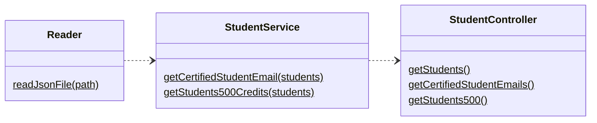
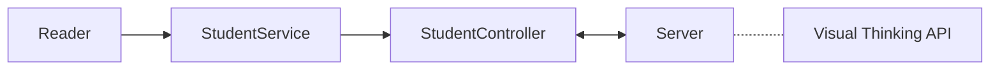

# Visual Thinking API

This is repository contains the web API designed for the Week 4 code challenge 
of LaunchX Node.js backend mission.

## Challenge description

The challenge is to create an API with three endpoints. The API should fetch 
data from a student database given by Visual Thinking. The endpoint requirements
are as follows:

1. Get all student information.
2. Fetch the e-mails of students who have certifications.
3. Get all names of students who have covered more than 500 course credits.

## Dependencies

- eslint: Code style following ECMAScript6 standards
- express.js: Web server
- Jest: Unit testing

To install the required modules, run the following command:

```cmd
npm install
```

## Endpoints

The following endpoints are implemented in the API for addressing the 
requirements.

| Endpoint | Request | Response |
| ------------------------------------- | ----------------------------- | --- |
| `localhost:3000`                      | `localhost:3000`              | Landing page |
| `localhost:3000/v1/students/`         | `localhost:3000/v1/students/` | Display all students enrolled in Visual Thinking |
| `localhost:3000/v1/students/credits`  | `localhost:3000/v1/credits/`  | Display the list of names of students who have covered more than 500 credits|
| `localhost:3000/v1/students/emails`   | `localhost:3000/v1/emails/`   | Display the list of e-mails of certified students|

## Functionality

The solution is split into several files, where each file is responsible for 
some of the requirements. This splitting is inspired by the 
Model-View-Controller-Service pattern. However, this is a simple backend 
solution.

| Files | Responsabilities |
|-------|------------------|
| `Reader.js` | A utility which reads the student database |
| `StudentService.js` | A service which implements the filter logic necessary for endpoints |
| `StudentController.js` | A controller layer which wraps services and utilities |
| `server.js` | A web server and API with the required endpoints |

### Diagrams

This class diagram shows the classes developed for this solution, their methods, 
as well as the dependencies between classes.

#### Class diagram



#### Flowchart
This flowchart shows the solution workflow. 

